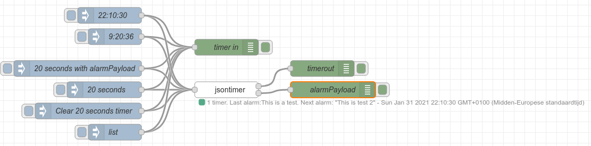

Use this to set timers to alarm at a specific time

<b>Input</b>

Set topic to 'set' to set a timer or 'clear' to clear an existing timer  or 'list' to list all timers.

Following payload properties can be used:

* id: Specify the id for the timer. Can be used to clear it and will be set on events.
* One of following time settings: 
    * timeout: A relative timeout value in milliseconds when timer should trigger.
    * datetime: An absolute unixtimestamp in milliseconds when timer should trigger.
    * time: An absolute timer object with following properties.

        * hours: hour value of time to trigger the timer. Default 0
        * minutes: minute value of time to trigger the timer. Default 0
        * seconds: second value of time to trigger the timer. Default 0
        * milliseconds: millisecond value of time to trigge the timer. Default 0

            e.g.: For 22:13:36.010 specifiy { "hours": 22, "minutes":13, "seconds":36, "milliseconds": 10}
* alarmPayload: Specify the payload for the alarm event.

<b>Events</b>

Topic property will contain one of following values:
* settime: when time was set
* clearedtime: when time was cleared
* list: will contain a property 'timers' which is an array with each timer currently active
* alarm: when timer triggered
* error: when an error occured during setting of timer



Example flow:
```json
[{"id":"ec99b4da.293d4","type":"tab","label":"jsontimer example","disabled":false,"info":""},{"id":"7279d624.7be1e","type":"jsontimer","z":"ec99b4da.293d4","name":"","x":440,"y":200,"wires":[["f7b7a7a8.610e08"],["abb7e0fe.204fe8"]]},{"id":"f7b7a7a8.610e08","type":"debug","z":"ec99b4da.293d4","name":"timerout","active":true,"tosidebar":true,"console":false,"tostatus":false,"complete":"true","targetType":"full","statusVal":"","statusType":"auto","x":620,"y":160,"wires":[]},{"id":"781c568e.7274d","type":"inject","z":"ec99b4da.293d4","name":"20 seconds","props":[{"p":"payload"},{"p":"topic","vt":"str"}],"repeat":"","crontab":"","once":false,"onceDelay":0.1,"topic":"set","payload":"{\"id\":\"This is a test\",\"timeout\":20000}","payloadType":"json","x":210,"y":200,"wires":[["7279d624.7be1e","af6927b1.cf26b"]]},{"id":"af6927b1.cf26b","type":"debug","z":"ec99b4da.293d4","name":"timer in","active":true,"tosidebar":true,"console":false,"tostatus":false,"complete":"true","targetType":"full","statusVal":"","statusType":"auto","x":440,"y":120,"wires":[]},{"id":"65d3a29.abf2fdc","type":"inject","z":"ec99b4da.293d4","name":"Clear 20 seconds timer","props":[{"p":"payload"},{"p":"topic","vt":"str"}],"repeat":"","crontab":"","once":false,"onceDelay":0.1,"topic":"clear","payload":"{\"id\":\"This is a test\"}","payloadType":"json","x":180,"y":240,"wires":[["7279d624.7be1e","af6927b1.cf26b"]]},{"id":"dd59dba0.990e4","type":"inject","z":"ec99b4da.293d4","name":"9:20:36","props":[{"p":"payload"},{"p":"topic","vt":"str"}],"repeat":"","crontab":"","once":false,"onceDelay":0.1,"topic":"set","payload":"{\"id\":\"This is a test\",\"time\":{\"hours\":9,\"minutes\":20,\"seconds\":36}}","payloadType":"json","x":230,"y":100,"wires":[["7279d624.7be1e","af6927b1.cf26b"]]},{"id":"c4ca6c73.9a36a","type":"inject","z":"ec99b4da.293d4","name":"20 seconds with alarmPayload","props":[{"p":"payload"},{"p":"topic","vt":"str"}],"repeat":"","crontab":"","once":false,"onceDelay":0.1,"topic":"set","payload":"{\"id\":\"This is a test\",\"timeout\":20000,\"alarmPayload\":{\"test\":\"This is a test\"}}","payloadType":"json","x":160,"y":160,"wires":[["7279d624.7be1e","af6927b1.cf26b"]]},{"id":"de1f5c99.ee56e8","type":"inject","z":"ec99b4da.293d4","name":"list","props":[{"p":"topic","vt":"str"}],"repeat":"","crontab":"","once":false,"onceDelay":0.1,"topic":"list","x":230,"y":280,"wires":[["7279d624.7be1e","af6927b1.cf26b"]]},{"id":"237f8783.835e5","type":"inject","z":"ec99b4da.293d4","name":"22:10:30","props":[{"p":"payload"},{"p":"topic","vt":"str"}],"repeat":"","crontab":"","once":false,"onceDelay":0.1,"topic":"set","payload":"{\"id\":\"This is test 2\",\"time\":{\"hours\":22,\"minutes\":10,\"seconds\":30}}","payloadType":"json","x":220,"y":60,"wires":[["7279d624.7be1e","af6927b1.cf26b"]]},{"id":"abb7e0fe.204fe8","type":"debug","z":"ec99b4da.293d4","name":"alarmPayload","active":true,"tosidebar":true,"console":false,"tostatus":false,"complete":"true","targetType":"full","statusVal":"","statusType":"auto","x":640,"y":200,"wires":[]}]
```